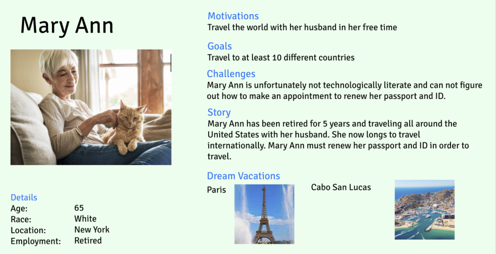
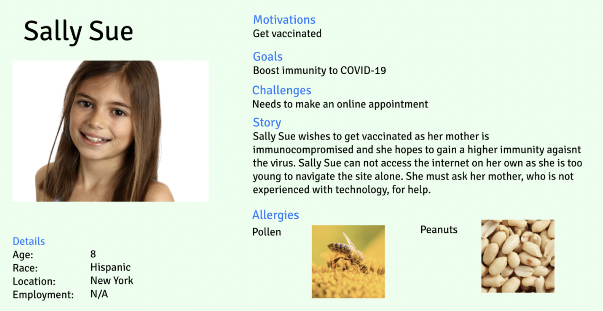
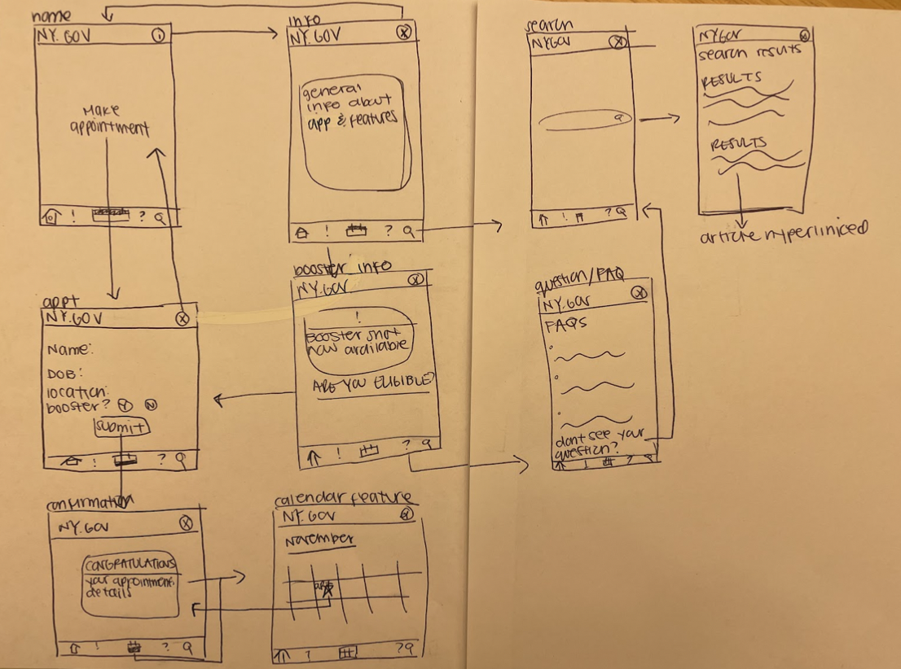
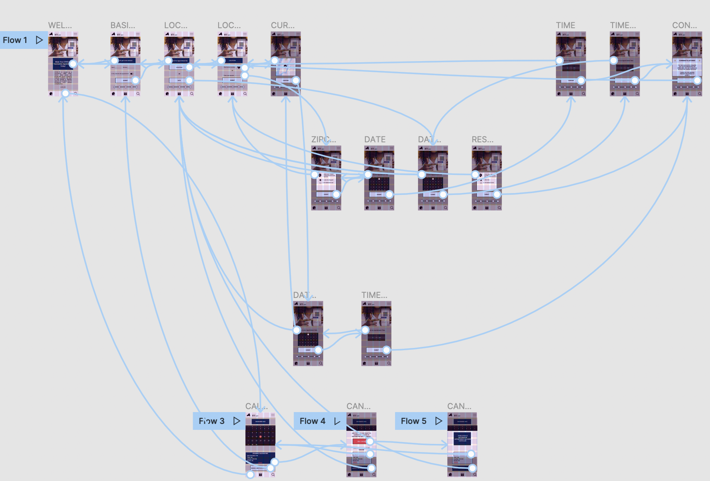

# NY-COVID-Appointment-App
### By Lana Garrett // DH110 Fall 2021
## Introduction
> The NY COVID-19 Vaccination Appointment App is an app based on the NY government site built for the same purpose. Making vaccine appointments can prove to be confusing for those that are not experienced with technology. I set out to combat this challenge in designing an easy to use app to help allow citizens to get vaccinate and protect themselves against the ongoing pandemic. In this app you can easily create an appointment, cancel an appointmentm get information about th4e booster vaccines, etc. It is important that all members of society can use and access these resources in any state. Through creating this app, this accessibility to healthcare is truly what I had as my top priority.
## Design Statement
> In creating the app, I kept the user in mind at all times. All throughout the process of creating and ideating, I was constantly asking myself, "Is this as simple as can be for the user?". By creating an easy to use app that lets you schedule your vaccination appointment in various ways, I answered this question with a strong yes. In creating this app, I hope my target audience and users can say the same.
## Competitor Analysis
> To see how government websites display their information, specifically information regarding COVID-19, I conducted heuristic evaluations on two websites. I did my first evaluation on the New Yrok government site where one would schedule an appointment to get or renew their ID. The second site I did my evauluation on was the New York COVID0-19 Vaccination Appointment website. I chose to analyze these two sites because they both showed how an average New Yorker would schedule appointments for governemnt services. By evaluating them against the 10 heuristic, I am more informed about how these websites choose to present information to account for user experience.[Read more...](https://github.com/lanag1/Heuristic-Evaluation).
## User Research
> I conducted usability testing about the current New York website that is used to schedule COVID-19 vaccination appointments. In conducting this test on the existing website, I could determine the extent to which an interface limits the target user’s ability to complete the simple tasks. The purpose of the usability testing is to find out how to create an app that can make this process easier from the user’s perspective. I learned that usability issues do exist for this the current NY COVID governemnt website. For example, my participant ran into some issues completing the basic tasks included in the usability test. That means that the average user likely runs into these issues as well and can not complete the appointment scheduling process. In conducting this test, I also sharpened my skills in how to give these tests and receive useful feedback. After the tests, I remembered to keep the issues my user came across in mind when designing my app to provide a better user experience for the target user. [Read more...](https://github.com/lanag1/Pilot-UT).
## UX Storytelling
> By creating personas, scenarios, user journeys, and empathy maps for our users we can gain empathy for them and gain insight into their experiences. By doing this we are thus placed in the shoes of our user. Throughout the entire design process, it is important to keep these personas in mind to make the experience as easy for the user as possible. Based on my understanding of my target users, I developed two personas and scenarios that depicted the typical interactions with the app. One persona represents the younger audience and the other persona represents the older generation. By doung these two personas, we are seeing the two ends of the spectrum when it comes to knowledge about technology. [Read more...](https://github.com/lanag1/Persona-and-Scenario).
> 
## Low-fidelity Prototype
> The purpose of creating and testing a low-fidelity prototype is to test whether the features that I aim to include on the app are useful for the target audience and users. According to the user research I conducted, the user personas that I have identified are people who are all members of the population, with children and senior citizens needing the most assistance as they are the least experienced with technology. The target user wants to easily make a COVID-19 vaccination appointment as well as get information regarding the vaccine and booster doses. These are features I included as well as how to cancel an appointment, a calendar feature to view appointments, and multiple ways to view where vaccinations are offered. People can search for an appointment by current location or zip code, making finding an appointment easy. [Read more...](https://github.com/lanag1/UX-Design-of-a-Government-Website).

## High-fidelity Prototype
> After reviewing the low-fidelity prototype assignment, I created a high-fidelity prototype of NY COVID-19 Vaccination Appointment app. The prototype was created on Figma and can be found [here](https://www.figma.com/proto/zQde8zfSSDwme3zbCvIUJ6/Untitled?node-id=1%3A6&scaling=scale-down&page-id=0%3A1&starting-point-node-id=1%3A6&show-proto-sidebar=1). The purpose of the high-fidelity prototype is to examine the functions I designed based on the two personas I previously created. This high-fidelity prototype was created from the low-fidelity, hand-drawn prototype I had previously created. My low-fidelity prototype had lots of mistakes and missing features so this interactive prototype came with lots of improved elements and design components. I tested various color schemes, including light-mode and dark-mode as well as different layouts and shapes for buttons. My final design passed all usability and color tests. [Read more...](https://github.com/lanag1/A08-High-Fidelity-Interactive-Prototype).

## Evaluation and Revision History
I conducted 3 more usability tests. The videos of these usability tests can be found below:
* [Sam's Usability Test](https://youtu.be/eQfhz4ft9Kg)
* [Henry's Usability Test](https://youtu.be/mJJl1pd2Sa4)
* [Smayra's Usability Test](https://youtu.be/yzspJebfewQ)
### Findings from Additional Testing
> I decided to conduct 3 additional tests with friends from home. I did not make many revisions to my design after seeing where my users had confusion in the processes I wireframed. All my participants could easily navigate the app I designed with little to no direction. The main sources of confusion that my users encountered was with features that were not yet wireframed or with features such as scrolling for the date or typing your zipcode which would be included in the full functioning design of the app. Some minor changed needed to be made regarding my wireframing after tests like Henry's for example as he got stuck towards the end of the task when there was no clear "undo" or "home" button wireframed in my design. I have since made the wireframe take you to the home page if you wish to get off of the calendar tab as an "undo" button would serve the same function.
